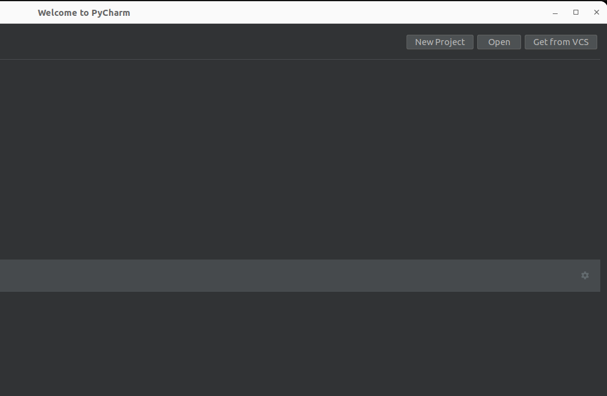
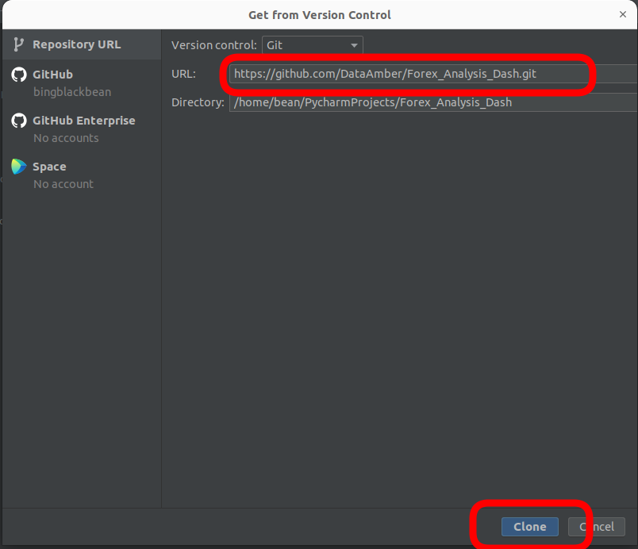
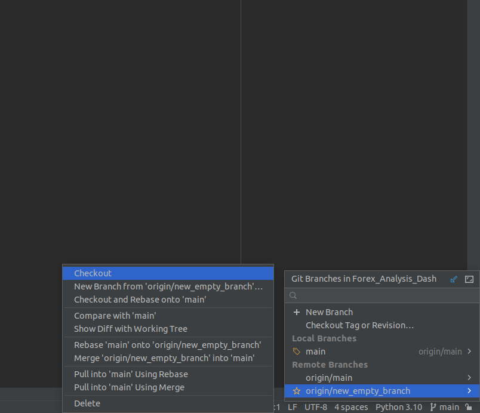
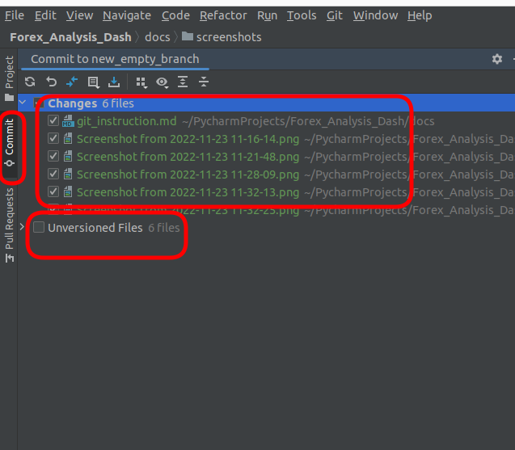

# 外汇分析预测平台 git入门

# 1. 初始化项目
这里以Pycharm为例，点击get from VCS.


输入项目git 地址，clone。
```https://github.com/DataAmber/Forex_Analysis_Dash.git```

如果你没有登陆的你的github，可能会提醒你登录。



# 2. Branch 切换
每个组都会在自己的branch进行设计，这里我们都从new_empty_branch 开始,后续可以从其他branch 开始设计。 
点击Pycharm右下角的main，选择new_empty_branch，之后点击checkout。
切换到新的branch之后，就可以在这个branch 工作了。



# 3. 编写代码
这里根据自己情况而定。

# 4. 提交代码/文档 
点击commit 按钮（ctrl+K），切换之commit 管理界面。 选择你需要提交的变更。 
如果发现没有你要的文档或者代码，去unversioned files 里面寻找。



# 5. create new branch , push 到github
点击push （ctrl + shift + K）， push到github上。
